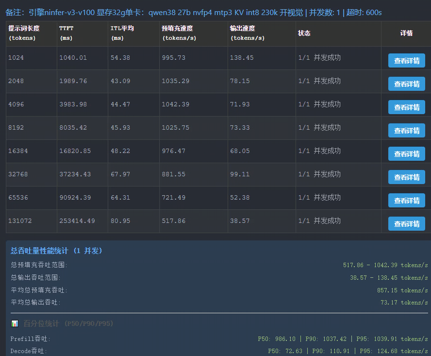

# Qwen3.8-27B EfficientThink-K3-MTP-NVFP4 (nvfp4-mixed)

社区定制制品：**FP8 投影 + 逐模块 NVFP4/FP8 混合 MLP**（敏感模块保留 FP8，其余 NVFP4），带 MTP 投机解码头。

- **下载（ModelScope 公开仓）**：<https://www.modelscope.cn/models/chengxian7788/Qwen3.8-27B-EfficientThink-K3-MTP-NVFP4-Ninfer>
- 制品 SHA256：`6846dd19dc02d52ca45b52855266ac586ed726d5d0b7c18467ca4f485fbdc8b6`
- 权重身份：`qwen3.8-27b / nvfp4-mixed`（v3 容器，引擎 master 分支直接加载，无需转换）

## 启动（Tesla V100 32G 单卡）

```bash
CUDA_VISIBLE_DEVICES=2 build-v100/apps/ninfer-serve \
  /data/models/ninfer/qwen3_8_27b_nvfp4_EfficientThink_K3.ninfer \
  --host 0.0.0.0 --port 7006 --device 0 --model-id qwen3.8-27b \
  --max-context 221184 --prefill-chunk 1024 --kv-capacity auto \
  --max-concurrency 1 --kv-dtype int8 --device-state-slots 1 \
  --host-state-slots 8 --host-kv-mib 4096 \
  --spec mtp --draft-tokens 3 --lm-head-draft --preserve-thinking \
  --pending-timeout-ms 600000 --log-level info
```

启动成功的日志基线：

```
weights ready | 20.7 GiB
capacity | KV 221,184 tokens, int8, auto | pages 3,456/3,456 | runtime 9.33 GiB | free 1.48 GiB
listening on http://0.0.0.0:7006 | model qwen3.8-27b
```

> **221,184 是 V100 32G 的结构上限**（混合权重 22.3GB 比 stock 大 1.9GB，运行时预留随
> max-context 线性增长；230,000 实测规划期超限约 0.7GB）。`--kv-capacity auto` 自带的
> 1024 MiB 安全余量无法被利用，属引擎设计行为。

## 基准

### Stock Qwen3.8-27B NVFP4 基线（单卡 32G，MTP3，KV int8，230k，开视觉，并发 1）



| 提示词长度 (tokens) | TTFT (ms) | ITL平均 (ms) | 预填充 (tokens/s) | 输出 (tokens/s) |
|---|---|---|---|---|
| 1024 | 1040.01 | 54.38 | 995.73 | 138.45 |
| 2048 | 1989.76 | 43.09 | 1035.29 | 78.15 |
| 4096 | 3983.98 | 44.47 | 1042.39 | 71.93 |
| 8192 | 8035.42 | 45.93 | 1025.75 | 73.33 |
| 16384 | 16820.85 | 49.22 | 976.47 | 68.05 |
| 32768 | 37234.43 | 67.97 | 881.55 | 99.11 |
| 65536 | 90924.39 | 64.31 | 721.49 | 52.38 |
| 131072 | 253414.49 | 80.95 | 517.86 | 38.57 |

平均：预填充 857.15 tokens/s，输出 73.17 tokens/s（P50：预填充 886.10 / 解码 72.63；P90：1037.42 / 110.91；P95：1039.91 / 124.68）。

### EfficientThink-K3 mixed 实测（91 token prompt / 384 token 贪心）

- decode ≈ **68 tok/s**（stock 73.4，-7.4%，与权重字节 +9.3% 近似成正比——FP8 模块比
  NVFP4 多约一倍的存储字节，解码是权重带宽瓶颈）
- prefill ≈ 249 tok/s（91 token 单 chunk，延迟主导）
- MTP 接受率 ≈ 59%
- 连续多轮（含缓存重放）输出稳定，无重复字符退化

## 注意事项

- 敏感层（前 4 层等）保留 FP8 是质量取舍；如需回到 stock 速度可自行重编码这些模块为
  NVFP4（转换器见 `tools/convert/qwen3_8_27b/`），引擎无需改动。
- 已知历史问题：v2 制品上的"缓存重放轮交替输出垃圾"仅存在于 v2 加载路径，v3 不复现。
